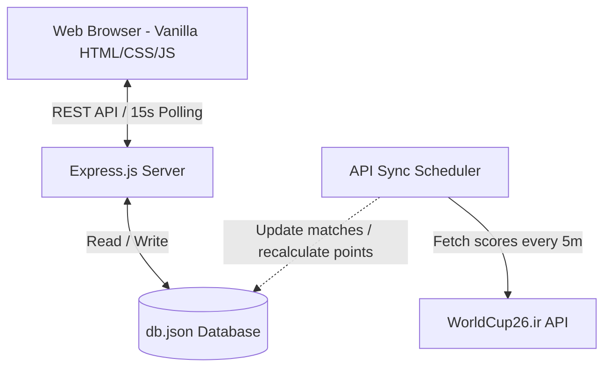

# 📋 World Cup 2026 Predictor Pool - Project Summary & Architecture

This document provides a comprehensive overview of the application, its underlying technical architecture, deployment workflow, and a summary of the recent enhancements implemented.

---

## 🏆 1. Application Overview

The **World Cup 2026 Predictor Pool** is a premium, lightweight, real-time web application designed for social groups (supporting up to 30 players) to compete during the FIFA World Cup 2026.

### Core User Workflows:
1. **PIN-Based Login:** Users log in using a unique username and a simple 4-digit PIN. No complex registration or database overhead is required.
2. **Match Predictions:** Logged-in players predict match outcomes (Team 1 Win, Draw, or Team 2 Win). Predictions are saved automatically.
3. **Automatic Lockout:** To ensure fairness, predictions for any match are automatically locked **15 minutes before its scheduled kickoff time** (calculated in Bangkok Local Time, UTC+7).
4. **Real-time Live Comparison (Matrix):** Once a match is locked or finished, everyone’s predictions are fully revealed in a comparative grid matrix, allowing players to view predictions and follow live standings.
5. **Background Score Sync:** An automated scheduler fetches real-time game schedules, live scores, and finished results from the official API.

---

## 🏗️ 2. Technical Architecture

The application is structured as a light-weight, single-host **Full-Stack JavaScript Application** designed for low resource consumption and easy deployment:



### 🔹 Frontend (Client-side)
- **Tech Stack:** Vanilla HTML5, CSS3, and ES6 JavaScript.
- **Styling:** "Midnight Neon" dark-mode layout utilizing CSS variables, glassmorphism, responsive grids, and clean visual indicators.
- **Features:** 
  - Real-time digital clock synced with server time.
  - Active countdown clocks for each match kickoff and lock threshold.
  - Standardized flag rendering using **FlagCDN** PNG urls to prevent Windows emoji rendering bugs.
  - Real-time polling (every 15 seconds) to fetch updated matches and leaderboard standings.

### 🔹 Backend (Server-side)
- **Tech Stack:** Node.js with Express.js.
- **REST Endpoints:**
  - `POST /api/login` - Validates user credentials.
  - `GET /api/matches` - Retrieves matches with lock status and prediction results.
  - `POST /api/predict` - Records or cancels a user's prediction.
  - `GET /api/leaderboard` - Calculates points and returns standings alongside the matrix grid.
  - `POST /api/admin/reset` - Admin-only endpoint to clear data and trigger instant API re-sync.
- **Score & Standings Logic:** 
  - Correct predictions award **1 point**. Incorrect predictions award **0 points**.
  - Tie-breaker sorting: Points (Desc) ➡️ Total Correct Predictions (Desc) ➡️ Player Name (Asc).

### 🔹 Background Sync Scheduler
- An automated cron-like task runs every **5 minutes** (and on server startup) inside `server.js`.
- It fetches official data from the public API (`https://worldcup26.ir/get/games`).
- Translates stadium time zones (US Eastern `-04:00`, Central `-05:00`, Mountain `-06:00`, Pacific `-07:00`) into Bangkok Time (`UTC+7`).
- Auto-imports new matches and updates live/concluded scores.

---

## 🐳 3. Dockerization & Volume Isolation Architecture

To make the application modular, portable, and secure, the runtime layout is divided into **Stateless App Layers** and **Stateful Data Volumes**:

```
[ Host Machine ]
   │
   ├── [ Docker Compose Service ]
   │     └── worldcup-predictor (Node Container)
   │           └── /app/server.js (Stateless code)
   │
   └── [ Docker Named Volume ]
         └── worldcup-data
               └── mounted to /app/data/
                     └── db.json (Stateful Database)
```

- **Stateless Container:** Contains only the application logic, styles, and templates. When you update the code, this layer is safely destroyed and recreated.
- **Stateful named volume (`worldcup-data`):** Holds the database `db.json`. It is mounted at `/app/data/` inside the container.
- **Auto-Seeding Logic:** On container boot, `server.js` checks if the volume holds a `db.json` file. If the file is missing (e.g., first run), it copies the initial clean seed database containing only the `admin` account, ensuring zero-configuration startups.

---

## 🔁 4. Multi-Platform GitHub Actions CI/CD Pipeline

A GitHub Actions workflow is established in `.github/workflows/docker-build.yml` to compile and publish the application:

1. **Trigger:** Fires on any push or pull request to the `main` or `master` branches.
2. **QEMU Emulation:** Sets up QEMU hardware emulation to allow the x86-64 GitHub runner to execute ARM instructions.
3. **Docker Buildx:** Builds a **Multi-Architecture Manifest** supporting:
   * `linux/amd64` (Standard Cloud Servers/PCs)
   * `linux/arm64` (Raspberry Pi 3/4/5 and Apple Silicon)
4. **Container Registry:** Logs in and pushes the built image directly to **GitHub Container Registry (GHCR)** as `ghcr.io/mrkaqz/worldcup:latest`.

---

## 🔄 5. Summary of Recent Enhancements

### 🟢 Matrix Horizontal Scrollbar & Layout Repair
- **Scrollbar Restored:** Removed a problematic WebKit scrollbar `display: block !important` CSS rule that caused scrollbars to disappear on Windows browsers.
- **Footer Sticky Layout:** Converted the absolute layout (`position: absolute; bottom: 0;`) of the footer to a proper Flexbox flow. This prevents the footer from overlapping the bottom of the matrix grid and blocking scrollbar pointer events.
- **Scrollbar Styling:** Colored the scrollbar track and thumb in bright neon-blue (`#00f2fe`) for maximum dark-theme contrast.

### 🟢 Matrix Team Abbreviations (Readability)
- Changed cell output values in the comparison matrix from generic markers (`1` / `X` / `2`) to the actual 3-letter country code abbreviation of the predicted winner (e.g., `MEX`, `AUS`, `BRA`) and `Draw` for draws. 

### 🟢 Danger Zone Admin Reset Button
- Added a new `POST /api/admin/reset` backend route and an interactive **Reset Predictor Data** card on the Admin panel.
- Allows admins to wipe all mock/player data and predictions to start a clean season. It immediately triggers the API sync job to download real matches instantly.
- The template `db.json` in the Git repository has been cleaned to contain only the default `admin` credentials (PIN `8888`) for a production-ready deploy.
